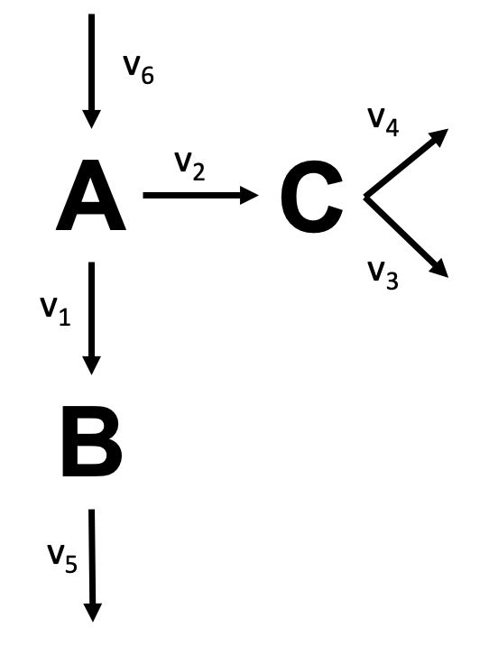

# Metabolic Flux Analysis - Assignment

In `assignment.py`:

1. Encode the network's[1] stoichiometry as a stoichiometry matrix. Arrows encode flux direction. Please also check reaction formulas provided in `assignment.py`.
2. Calculate the degrees of freedom using numpy.
3. Calculate fluxes based on measured fluxes.

Hints:
* v_c = -S_c^-1 S_m v_m
* `numpy.linalg.matrix_rank`, `numpy.linalg.inv`

[1]The network schematic

